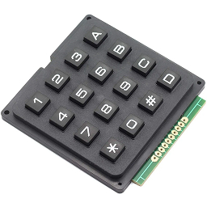
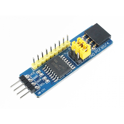
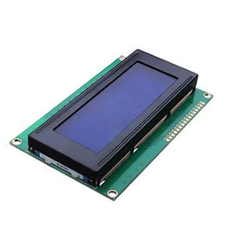
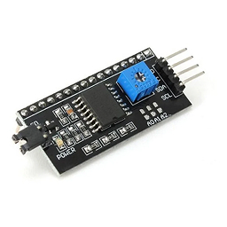
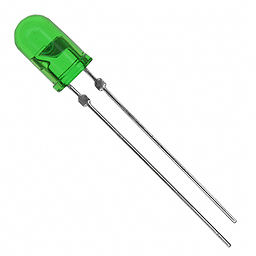
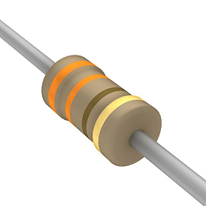
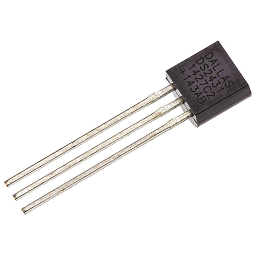
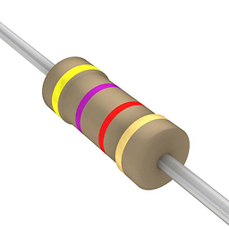
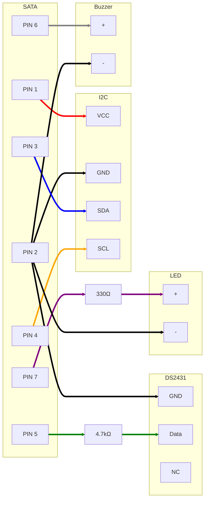

# ⚙️ IHM de Configuração

Interface Humana-Máquina para configuração de módulos do Projeto Ogiva.

---

## 📋 Objetivo

Esta IHM de configuração foi desenvolvida para fornecer **interfaces de entrada e saída simples e padronizadas** para os módulos do Projeto Ogiva.

Seu principal objetivo é **reduzir a complexidade de desenvolvimento** de cada módulo ao centralizar a responsabilidade de interação com o usuário em um único ponto. Com isso, os módulos podem focar exclusivamente em suas lógicas de jogo, enquanto a IHM lida com a configuração do jogo no módulo.

A solução também visa oferecer uma **experiência amigável ao usuário final**, utilizando poucos componentes e mantendo o custo acessível.

## ✨ Funcionalidades

- Fornece uma **interface padronizada** de entrada e saída para configurações de módulos
- Disponibiliza uma **biblioteca pronta para uso** nos módulos, padronizando a comunicação com a IHM
- Reduz a **carga cognitiva durante o desenvolvimento** ao abstrair a interação com o usuário
- Permite configuração de parâmetros como: tempo, dificuldade, modo de jogo, etc.

## 🔌 Componentes Eletrônicos

### Teclado Matricial 4x4

16 botões em matriz 4x4



---

### Módulo PCF8574 I/O

Expansor De I/O 8-bit I²C genérico para interface com teclado



---

### Display LCD 1604A

Display 16 colunas x 4 linhas com controlador HD44780



---

### Módulo PCF8574 LCD

Adaptador I²C específico para displays LCD



---

### LED 5mm Verde

Indicador de status de funcionamento



---

### Resistor 330Ω

Resistor limitador de corrente para o LED de status

**Notações equivalentes:**

- 330Ω / 330R / 330 ohms
- Código SMD: 331



---

### Buzzer Contínuo Com Oscilador 3V

Buzzer com oscilador integrado para feedback sonoro


---

### Conector SATA Fêmea 7 Pinos

Conector para alimentação e comunicação I²C


---

### DS2431

Chip 1-Wire EEPROM 1024 bits para identificação única

**Configuração: Modo Parasita**

- **GND**: Terra
- **IO**: Dados 1-Wire (com pull-up)
- **VCC/NC**: Não conectado (modo parasita)

> No modo parasita, o chip é alimentado pela linha de dados através do resistor pull-up.



---

### Resistor 4.7kΩ

Resistor pull-up para linha 1-Wire do DS2431

**Notações equivalentes:**

- 4.7kΩ / 4k7 / 4.7K / 4700Ω / 4700R
- Código SMD: 472



## 🔧 Pinagem SATA (Fêmea 7 pinos)

| Pino | Nome                | Função                                          | Direção      |
| ---- | ------------------- | ----------------------------------------------- | ------------ |
| 1    | **VCC**             | Alimentação 3.3V para todos os componentes      | Entrada      |
| 2    | **GND**             | Terra comum entre IHM e módulo                  | Comum        |
| 3    | **SDA**             | Comunicação I2C (dados) para teclado e display  | Bidirecional |
| 4    | **SCL**             | Comunicação I2C (clock) para teclado e display  | Entrada      |
| 5    | **1-Wire (DS2431)** | Identificação única da IHM via protocolo 1-Wire | Bidirecional |
| 6    | **Buzzer**          | Controle do buzzer                              | Entrada      |
| 7    | **LED Status**      | Controle do LED de status                       | Entrada      |

### Notas sobre Pinagem

- **Pino 5 (1-Wire/DS2431)**: Utiliza o chip DS2431 para:
  - Identificação única de cada IHM
  - Suporte a múltiplas IHMs conectadas via barramento
  - Armazenamento de configurações persistentes (1024 bits EEPROM)

### Diagrama de Conexões



## 💡 Funcionamento

A IHM de Configuração **não possui lógica interna**. Toda a inteligência é definida pelo módulo ao qual está conectada.

### Fluxo de Operação

1. **Detecção e Identificação**: O módulo detecta a presença da IHM via protocolo 1-Wire (DS2431) e lê sua identificação única

2. **Verificação**: O módulo realiza um teste de funcionamento de todos os componentes:
   - Display LCD (envio de mensagem de teste)
   - Teclado (verificação de comunicação I2C)
   - LED e Buzzer (teste rápido)

3. **Inicialização**: Se tudo estiver OK, o módulo acende o LED verde indicando prontidão

4. **Operação**:
   - O módulo envia mensagens/menus para o display
   - O usuário interage via teclado
   - O buzzer fornece feedback sonoro para cada ação
   - O módulo processa as entradas e atualiza o display

5. **Configuração Completa**: Após configurar o módulo, a IHM pode ser desconectada (dependendo do módulo)

## 📚 Biblioteca de Comunicação

Uma biblioteca padronizada está sendo desenvolvida para facilitar a integração com os módulos:

```cpp
// Exemplo de uso (pseudocódigo)
#include <OgivaIHM_Config.h>

OgivaIHM_Config ihm;

void setup() {
  if (ihm.detectar()) {
    uint64_t id = ihm.obterID(); // ID único do DS2431
    ihm.inicializar();
    ihm.exibirMenu("1-Bomba 2-Sequencia");

    char tecla = ihm.aguardarTecla();
    ihm.bip(); // Feedback sonoro

    // Processar escolha...
  }
}
```

### Funções Principais

- `detectar()` - Verifica presença da IHM via 1-Wire
- `obterID()` - Retorna ID único do DS2431 (64 bits)
- `inicializar()` - Testa e inicializa componentes
- `exibir()` - Envia texto para o display
- `aguardarTecla()` - Lê entrada do teclado
- `bip()` - Aciona buzzer para feedback
- `ledStatus()` - Controla LED de status

## � Lista de Materiais (BOM)

| Qtd | Componente        | Especificação                | Uso                    |
| --- | ----------------- | ---------------------------- | ---------------------- |
| 1   | Teclado Matricial | 4x4, 16 botões               | Entrada de dados       |
| 1   | Display LCD       | 1604A (16x4)                 | Saída visual           |
| 1   | PCF8574 I/O       | Expansor I²C genérico (azul) | Interface teclado      |
| 1   | PCF8574 LCD       | Adaptador I²C para LCD       | Interface display      |
| 1   | LED               | 5mm verde                    | Indicador de status    |
| 1   | Resistor          | 330Ω (330R)                  | Limitador corrente LED |
| 1   | Buzzer            | Contínuo com oscilador 3V    | Feedback sonoro        |
| 1   | Conector SATA     | 7 pinos fêmea                | Interface módulo       |
| 1   | DS2431            | 1-Wire EEPROM 1024 bits      | Identificação única    |
| 1   | Resistor          | 4.7kΩ (4k7)                  | Pull-up 1-Wire         |
| -   | Diversos          | Fios, placa, solda           | Montagem               |

## �🚀 Status de Desenvolvimento

| Componente             | Status                 |
| ---------------------- | ---------------------- |
| Hardware (Esquemático) | 🟡 Em progresso        |
| Biblioteca Arduino     | 🟡 Em progresso        |
| Documentação           | 🟡 Em progresso        |
| Testes                 | 🔴 Aguardando hardware |
| PCB                    | 🔴 Planejamento futuro |

---

[← Voltar para Documentação Principal](../../README.md)
