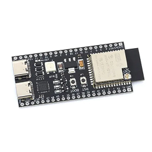
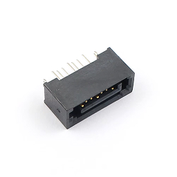
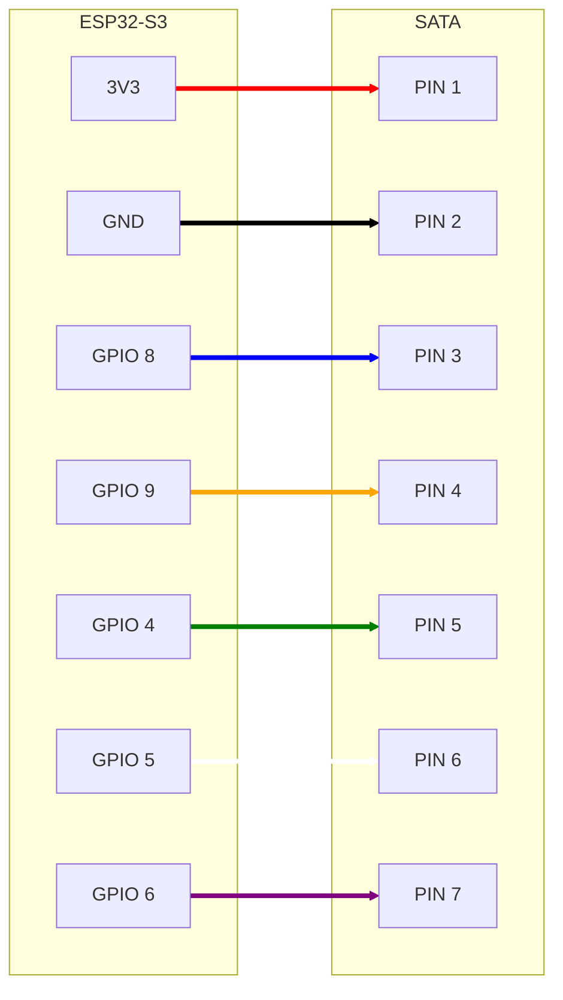

# 🔧 Componentes Comuns dos Módulos

Documentação dos componentes e especificações compartilhadas entre todos os módulos do Projeto Ogiva.

---

## 📋 Hardware Padrão

Todos os módulos do projeto utilizam a mesma plataforma de hardware base para garantir compatibilidade e facilitar o desenvolvimento.

### Microcontrolador

**YD-ESP32-S3 WIFI+BLE5.0 Development Board**  
Módulo: ESP32-S3-WROOM-1-N16R8

**Especificações:**
- **Chip**: ESP32-S3 (Dual-core Xtensa LX7)
- **SRAM interna**: 512KB
- **ROM interna**: 384KB
- **Flash externa**: 16MB
- **PSRAM externa**: 8MB
- **Conectividade**: WiFi 802.11 b/g/n + Bluetooth 5.0 (BLE)

---

### Conector de Interface (IHM)

**Conector SATA Fêmea 7 Pinos**

Utilizado para conexão com IHMs (Interfaces Humana-Máquina). O conector SATA fornece alimentação e comunicação em um único cabo.

---

## 🔌 Pinagem SATA para IHM

Todos os módulos devem implementar o seguinte padrão de pinagem SATA (Fêmea 7 pinos):

| Pino SATA | Sinal | GPIO ESP32 | Função | Direção |
|-----------|-------|------------|--------|---------|
| 1 | **VCC** | 3V3 | Alimentação 3.3V para IHM | Saída |
| 2 | **GND** | GND | Terra comum | Comum |
| 3 | **SDA** | GPIO 8 | Comunicação I²C (dados) | Bidirecional |
| 4 | **SCL** | GPIO 9 | Comunicação I²C (clock) | Saída |
| 5 | **1-Wire** | GPIO 4 | Detecção e ID da IHM (DS2431) | Bidirecional |
| 6 | **Buzzer** | GPIO 5 | Controle do buzzer da IHM | Saída |
| 7 | **LED Status** | GPIO 6 | Controle do LED de status da IHM | Saída |

### Notas Importantes

**Pino 1 (VCC - 3.3V):**
- O ESP32-S3 fornece 3.3V regulado
- Corrente máxima recomendada: 500mA
- Todos os componentes das IHMs devem operar em 3.3V

**Pinos 3 e 4 (I²C - SDA/SCL):**
- Padrão I²C para comunicação com display e teclado
- Resistores pull-up de 4.7kΩ recomendados
- GPIOs 8 e 9 são os pinos I²C padrão do ESP32-S3

**Pino 5 (1-Wire):**
- Protocolo 1-Wire para leitura do DS2431
- Permite identificação única de cada IHM conectada

**Pinos 6 e 7 (Buzzer/LED):**
- GPIOs de saída digital simples
- Corrente limitada: usar transistor/driver se necessário
- Lógica ativa HIGH (3.3V)

---

## 📐 Esquema de Conexão

---

## 🔧 Componentes Adicionais Recomendados

### Resistores Pull-Up I²C
- **2x 4.7kΩ** - Para SDA e SCL
- Conectar entre linha I²C e VCC (3.3V)

### Resistor Pull-Up 1-Wire
- **1x 4.7kΩ** - Para linha 1-Wire
- Conectar entre GPIO 4 e VCC (3.3V)

### Capacitor de Desacoplamento
- **100nF (0.1µF)** - Próximo ao pino VCC do conector SATA
- Reduz ruído na alimentação da IHM

---

[← Voltar para Documentação Principal](../README.md)
