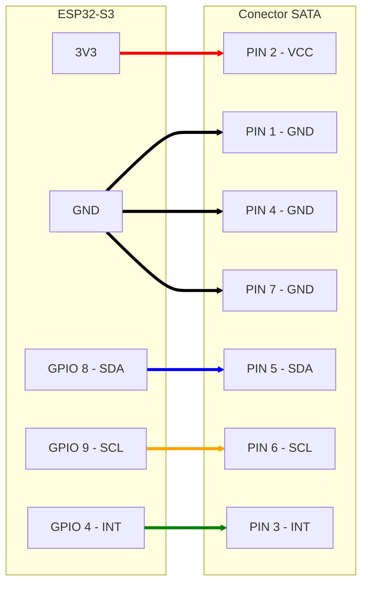

# 🔧 Componentes Comuns dos Módulos

Documentação dos componentes e especificações compartilhadas entre todos os módulos do Projeto Ogiva.

---

## 📋 Hardware Padrão

Todos os módulos do projeto utilizam a mesma plataforma de hardware base para garantir compatibilidade e facilitar o desenvolvimento.

### Microcontrolador

**YD-ESP32-S3 WIFI+BLE5.0 Development Board**  
Módulo: ESP32-S3-WROOM-1-N16R8

**Especificações:**

- **Chip**: ESP32-S3 (Dual-core Xtensa LX7)
- **SRAM interna**: 512KB
- **ROM interna**: 384KB
- **Flash externa**: 16MB
- **PSRAM externa**: 8MB
- **Conectividade**: WiFi 802.11 b/g/n + Bluetooth 5.0 (BLE)

---

### Conector de Interface (IHM)

**Conector SATA Fêmea 7 Pinos**

Utilizado para conexão com IHMs (Interfaces Humana-Máquina). O conector SATA fornece alimentação e comunicação em um único cabo.

---

## 🔌 Pinagem SATA para IHM

Todos os módulos devem implementar o seguinte padrão de pinagem SATA (Fêmea 7 pinos):

| Pino SATA | Sinal   | GPIO ESP32 | Função                      | Direção      |
| --------- | ------- | ---------- | --------------------------- | ------------ |
| 1         | **GND** | GND        | Terra comum                 | Comum        |
| 2         | **VCC** | 3V3        | Alimentação 3.3V para IHM   | Saída        |
| 3         | **INT** | GPIO 4     | Interrupção dos PCF8574 I/O | Entrada      |
| 4         | **GND** | GND        | Terra comum                 | Comum        |
| 5         | **SDA** | GPIO 8     | Comunicação I²C (dados)     | Bidirecional |
| 6         | **SCL** | GPIO 9     | Comunicação I²C (clock)     | Saída        |
| 7         | **GND** | GND        | Terra comum                 | Comum        |

### ⚠️ Importante: Padrão SATA de Aterramento

O conector SATA possui uma característica importante relacionada à confiabilidade elétrica:

**Pinos 1, 4 e 7 são interligados eletricamente no cabo SATA**

Esta é uma especificação do próprio padrão SATA que garante:

- **Melhor aterramento**: Múltiplos pontos de GND reduzem impedância e melhoram a qualidade do sinal
- **Redução de ruído**: Aterramento robusto minimiza interferências eletromagnéticas
- **Confiabilidade**: Mesmo se um pino tiver mau contato, os outros garantem a conexão de terra

💡 **Por isso todos os três pinos (1, 4 e 7) foram designados como GND** - eles funcionam como um único aterramento robusto.

### Notas Importantes

**Pinos 1, 4 e 7 (GND):**

- Terra comum, interligados eletricamente pelo padrão SATA
- Garantem aterramento robusto e confiável
- Reduzem ruído e interferências

**Pino 2 (VCC - 3.3V):**

- O ESP32-S3 fornece 3.3V regulado
- Corrente máxima recomendada: 500mA
- Todos os componentes das IHMs devem operar em 3.3V

**Pino 3 (INT):**

- Sinal de interrupção dos PCF8574 I/O
- Indica quando há dados disponíveis (ex: tecla pressionada)
- Resistor pull-up de 10kΩ recomendado

**Pinos 5 e 6 (I²C - SDA/SCL):**

- Padrão I²C para comunicação com módulos PCF8574
- Resistores pull-up de 4.7kΩ recomendados
- GPIOs 8 e 9 são os pinos I²C padrão do ESP32-S3

---

## 📐 Esquema de Conexão

---

## 🔧 Componentes Adicionais Recomendados

### Resistores Pull-Up I²C

- **2x 4.7kΩ** - Para SDA (GPIO 8) e SCL (GPIO 9)
- Conectar entre linha I²C e VCC (3.3V)
- Necessários para comunicação com PCF8574 e outros dispositivos I²C

### Resistor Pull-Up INT

- **1x 10kΩ** - Para linha INT (GPIO 4)
- Conectar entre GPIO 4 e VCC (3.3V)
- Necessário para sinal de interrupção dos PCF8574

### Capacitores de Desacoplamento

- **1x 100nF (0.1µF)** - Próximo ao pino VCC do conector SATA
- **2x 100nF (0.1µF)** - Um para cada PCF8574, próximo ao VCC
- Reduz ruído na alimentação e melhora estabilidade

---

[← Voltar para Documentação Principal](../README.md)
